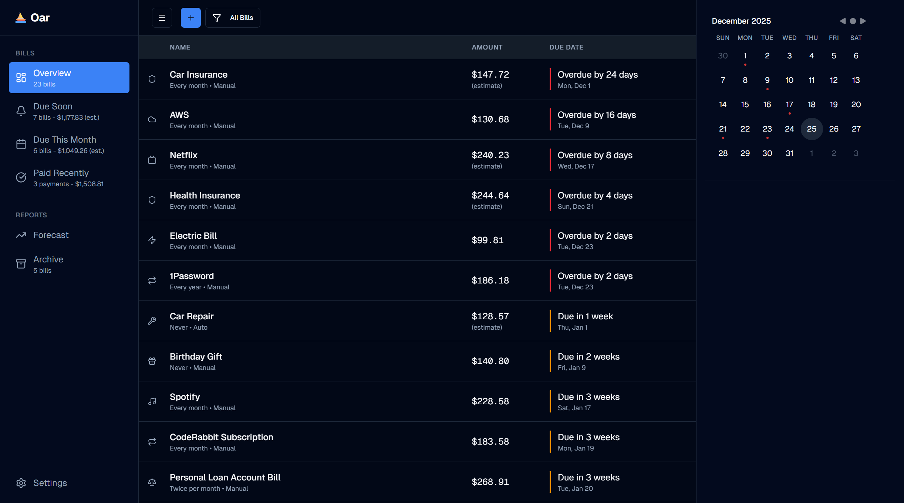

# Oar

A self-hosted, local-first bill manager for the Active Payer.

## Philosophy

Oar rejects mindless automation. Most expense trackers record what already happened; Oar makes you confront what's coming. Every payment requires your conscious acknowledgment. This friction prevents zombie subscriptions and builds financial awareness.

Sovereignty by default. Your data lives on your machine. No cloud sync, no telemetry, no external APIs. You own your financial truth.

## Features

### Core Philosophy

* Manual payment logging ensures deliberate action, preventing "subscription zombie" mode.
* 100% offline-capable, self-hosted on SQLite. Your data never leaves your device.

### Financial Intelligence

* Project liabilities months ahead using intelligent estimation for variable bills.
* Automatic amortization calculations ("Amount to Save") for non-monthly bills (e.g., insurance).
* Real-time view of what is Due Soon vs. Due This Month.

### Organization & Power Features

* Handles complex intervals (weekly, quarterly, yearly) with auto-advancement.
* Tagging system, auto-pay detection, and partial payment tracking.
* Complete transaction records with preserving logic for inactive bills.

## Tech stack

Next.js (App Router), SQLite (WAL mode), Drizzle ORM, shadcn/ui, Tailwind CSS, Docker

## Documentation

See [`docs/`](docs/README.md) directory for detailed documentation.

## License

This project is licensed under the MIT License.
